## Agenda

- The Data Pipeline (PEST)
- How to Learn the Representation? (Spherinator)
- The (Hyper-)Spherical Latent Space
- Interactive Visualization (HiPSter)
- The Shared Universe Engine (DynaVerse SUE)

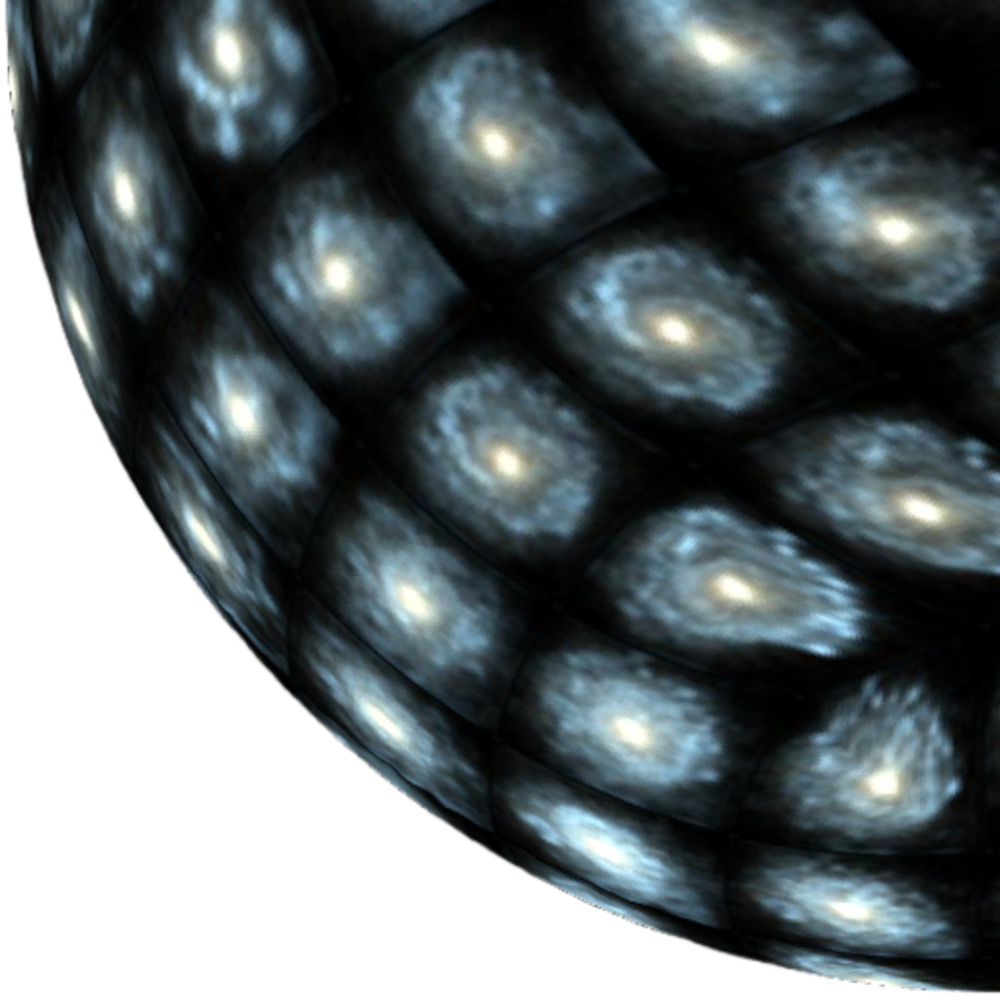{.absolute top=-120 right=-120 width="500" height="500"}


## Introduction

- The amount of astronomical data is growing exponentially
  - Exascale cosmological simulations produce **petabytes of data**
  - Surveys (e.g. Euclid, LSST) are generating **terabytes of data daily**

- Machine learning methods are needed to explore this amount of data

- **Our approach:** Modular open-source tools for self-supervised knowledge discovery\
  [PEST](https://github.com/HITS-AIN/PEST) $\rightarrow$ [Spherinator](https://github.com/HITS-AIN/Spherinator) $\rightarrow$ [HiPSter](https://github.com/HITS-AIN/HiPSter) $\rightarrow$ Shared Universe Engine


## End-to-End ML Pipeline {auto-animate="true"}

{fig-align="center"}


## 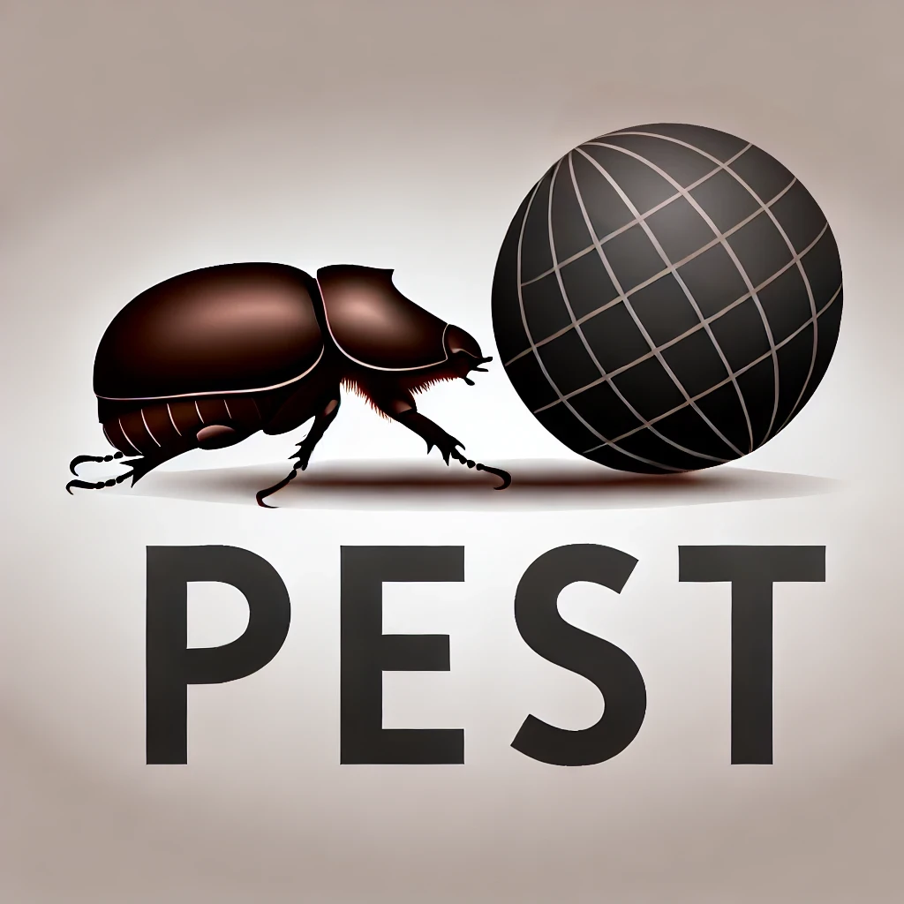{height="60px" style="vertical-align: middle;"} Data Acquisition {auto-animate="true"}

- [PEST](https://github.com/HITS-AIN/PEST) preprocesses universal cosmological simulation data into multi-channel images, data cubes, and point clouds
- PEST follows a classic Extract → Transform → Load pattern driven by a YAML configuration file.
- [Apache Parquet](https://parquet.apache.org/) stores multi-modal data in an efficient columnar data storage
- Uploads to [Zenodo](https://zenodo.org/) for open access and long-term preservation
- Upload to [Hugging Face Hub](https://huggingface.co/) for easy sharing and integration with machine learning workflows


## 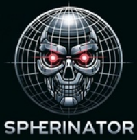{height="60px" style="vertical-align: middle;"} Representation Learning

- Representation learning using a **Variational Autoencoder**
- Dimensionality reduction to a **(Hyper-)Spherical Latent Space**
- Completely **self-supervised** — no labels required
- [ONNX](https://onnx.ai/) standardizes the machine learning model format for interoperability across frameworks and platforms

{width="900" fig-align="center"}

[@Polsterer2024; @Doser2026]{style="font-size: 50%;"}


## How many dimensions?

::: {style="font-size: 70%;"}
**PCA analysis** of the bottleneck feature space: eigenvalue decay reveals the intrinsic dimensionality of the data.
:::

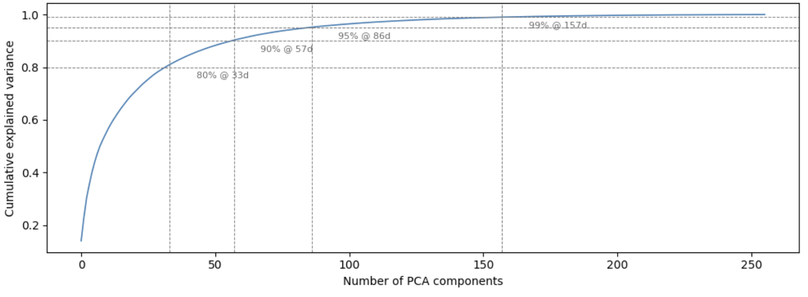{width="700" fig-align="center"}


## How many dimensions?

::: {style="font-size: 70%;"}
Determine the optimal number of dimensions in the latent space by analyzing the reconstruction.
:::


```{python}
#| fig-align: center
import pandas as pd
import plotly.graph_objects as go

df = pd.read_json("data/illustris_vae_resnet18.json")

fig = go.Figure()

fig.add_trace(go.Scatter(
    x=df["sdim"], y=df["l1loss_val_min"],
    mode="lines+markers",
    name="Validation",
    line=dict(color="#0088c2", width=3),
    marker=dict(size=10),
))

fig.add_trace(go.Scatter(
    x=df["sdim"], y=df["l1loss_train_min"],
    mode="lines+markers",
    name="Training",
    line=dict(color="#cee6f5", width=3),
    marker=dict(size=10),
))

fig.update_layout(
    hovermode=False,
    xaxis_title="S<sup>n</sup>",
    yaxis_title="L1 loss",
    paper_bgcolor="rgba(0,0,0,0)",
    plot_bgcolor="rgba(0,0,0,0)",
    font=dict(color="#cee6f5", size=16),
    xaxis=dict(gridcolor="rgba(206,230,245,0.2)", linecolor="rgba(206,230,245,0.4)"),
    yaxis=dict(gridcolor="rgba(206,230,245,0.2)", linecolor="rgba(206,230,245,0.4)"),
    legend=dict(bgcolor="rgba(0,0,0,0)"),
    margin=dict(l=60, r=20, t=20, b=60),
)

fig.show(config={"displayModeBar": False})
```


## Reconstruction Quality {auto-animate="true" style="font-size: 50%;"}

Original IllustrisTNG SKIRT SDSS images

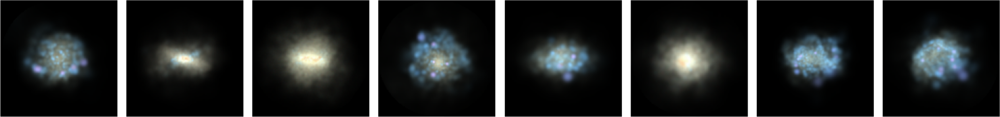{width="1000" fig-align="center"}

ResNet-18 autoencoder, 512 features: Sufficient reconstruction

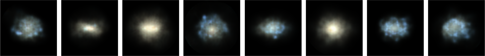{width="1000" fig-align="center"}


## Reconstruction Quality {auto-animate="true" style="font-size: 50%;"}

Original IllustrisTNG SKIRT SDSS images

{width="1000" fig-align="center"}

ResNet-18 VAE-S${^2}$: Details are lost, but the overall structure is preserved

{width="1000" fig-align="center"}

ResNet-18 VAE-S$^{128}$: Details are present, but blurry

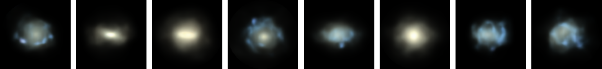{width="1000" fig-align="center"}


## UMAP vs. Spherinator

:::: {.columns}

::: {.column width="55%"}
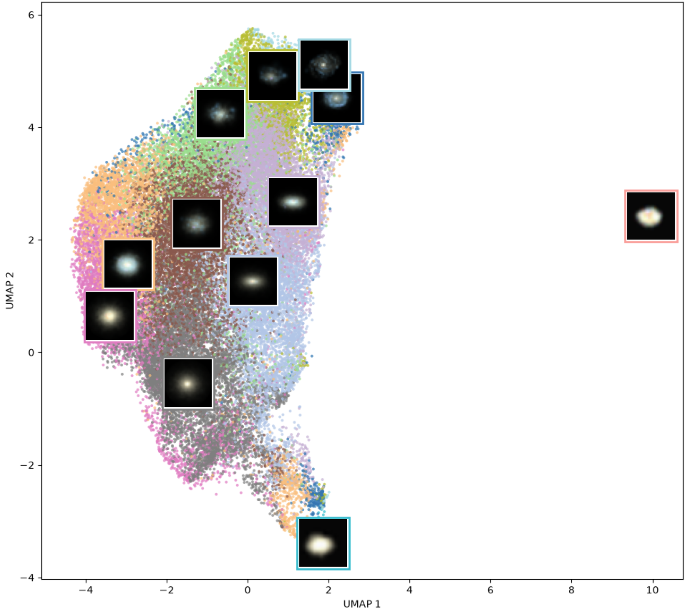{width="700" fig-align="center"}
:::

::: {.column width="45%"}

- UMAP is a popular dimensionality reduction technique, but it can distort the global structure of the data.
- Spherinator preserves the global geometry of the data on a hypersphere, leading to more meaningful representations.
:::

::::


## The Power Spherical Distribution {auto-animate="true"}

:::: {.columns}

::: {.column width="55%"}
- The **Power Spherical distribution** is a generalization of the von Mises-Fisher distribution, allowing for more flexible modeling of data on hyperspheres.
:::

::: {.column width="45%"}
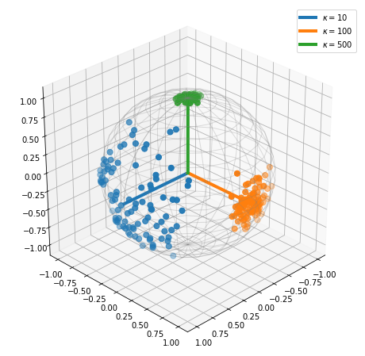{width="600" fig-align="center"}
[[@DeCao2020]]{style="font-size: 50%;"}
:::

::::


## {height="60px" style="vertical-align: middle;"} HiPSter

:::: {.columns}
::: {.column width="55%"}
- Takes the **spherical latent positions** from Spherinator
- Generates a **HiPS** (**Hi**erarchical **P**rogressive **S**urvey) map
- Enables **progressive zoom** - more detail as you zoom in
- Works with any standard HiPS viewer (e.g. [Aladin-Lite](https://github.com/cds-astro/aladin-lite))

:::
::: {.column width="45%"}
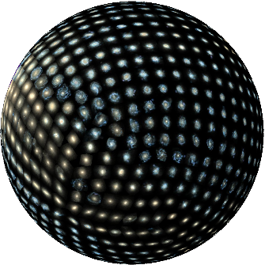{width="480" fig-align="center"}
:::
::::


<!-- ## HiPSter: The Inference

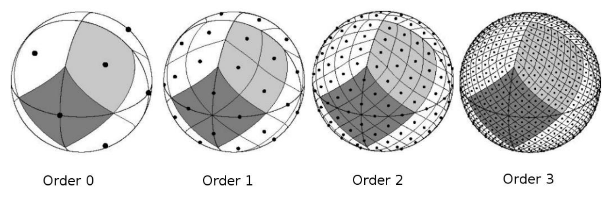{width="800" fig-align="center"}

- The **HEALPix framework** is used to generate a **Hierarchical Progressive Survey (HiPS)** for the corresponding spherical latent space positions.
- [Aladin-Lite](https://github.com/cds-astro/aladin-lite) is designed to visualize the HiPS representation.

[[@Fernique_2015]]{style="font-size: 50%;"} -->


## Demo: Celebrities

:::: {.columns}
::: {.column width="55%"}
::: {style="text-align: center; border: 1px solid #cee6f5; border-radius: 8px; padding: 0.5em 1em; margin-bottom: 0.75em; font-style: italic;"}
"Fill the sky with stars"
:::

- [tonyassi/celebrity-1000](https://huggingface.co/datasets/tonyassi/celebrity-1000): 18,184 images of 1000 celebrities
- Trained a VAE-S$^2$ with a ResNet-18
<!-- - Combined Reconstruction Loss:
  - L1
  - Perceptual Loss (VGG-16 features) -->

:::
::: {.column width="45%"}
<video src="../videos/celebrities.mp4" controls></video>
:::
::::


## Gaia Explorer {auto-animate="true"}

::: {style="font-size: 80%;"}
- [Gaia DR3 XP](http://cdn.gea.esac.esa.int/Gaia/gdr3/): Largest most uniform all-sky spectrophotometric survey (over 220 million sources)
- Low-resolution spectra reveal temperature and chemical composition
:::

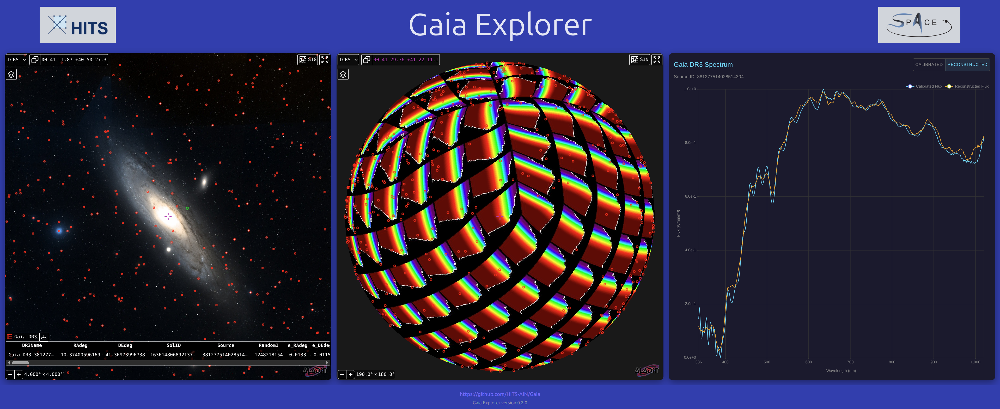{fig-align="center"}

::: {style="font-size: 50%;"}
@Doser2026
:::


## Gaia Explorer
<video src="../videos/presentation_ready.mp4" controls width="100%" height="85%"></video>


<!-- ## {background-video="../videos/presentation_ready.mp4"} -->


<!-- ## Deployment Platform

::: {style="font-size: 70%;"}
[Flyte](https://flyte.org/) orchestrates the full **PEST → Spherinator → HiPSter** workflow — reproducible, scalable pipelines on HPC and cloud infrastructure.
:::

{fig-align="center" width="900"} -->


## 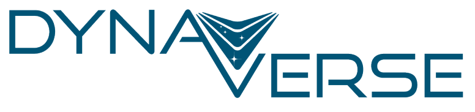{height="60px" style="vertical-align: middle;"} The Shared Universe Engine

- [DynaVerse](https://dynaverse.astro.uni-koeln.de/) (Our Dynamic Universe) is a German Cluster of Excellence that combines astrophysics, mathematics, and computer science to study how cosmic processes across vastly different timescales shape the universe

- The SUE (Shared Universe Engine) is a unified platform connecting data, models, and simulations across scales and disciplines

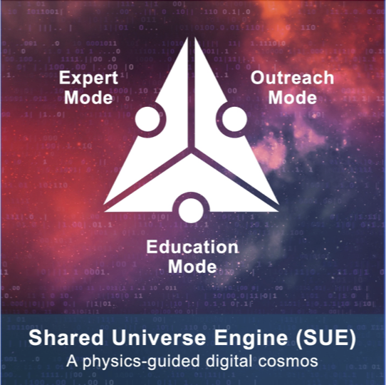{fig-align="center"}


## Summary and Outlook

- **PEST** — ETL pipeline for cosmological simulations (AREPO, ChaNGa, Gadget, RAMSES) and surveys
- **Spherinator** — self-supervised VAE with (hyper-)spherical latent space for unbiased representation learning
- **HiPSter** — scalable interactive visualization via progressive HiPS maps on the sphere
- **DynaVerse SUE** — unified platform connecting data, models, and simulations across scales and disciplines

- First results available at [space.h-its.org](https://space.h-its.org)


## Acknowledgement & Disclaimer

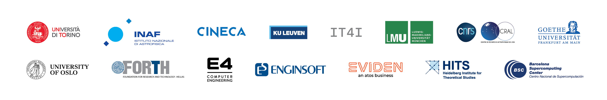{fig-align="center"}

::: {style="font-size: 60%; margin-top: -40px;"}
Funded by the European Union. This work has received funding from the European High Performance Computing Joint Undertaking (JU) and Belgium, Czech Republic, France, Germany, Greece, Italy, Norway, and Spain under grant agreement No 101093441.

Views and opinions expressed are however those of the author(s) only and do not necessarily reflect those of the European Union or the European High Performance Computing Joint Undertaking (JU) and Belgium, Czech Republic, France, Germany, Greece, Italy, Norway, and Spain. Neither the European Union nor the granting authority can be held responsible for them.
:::

{fig-align="center" width="400"}


## Associated Materials

<!-- {.absolute top=50 right=0 width=200} -->

- Repositories:
  - [PEST](https://github.com/HITS-AIN/PEST): Data acquisition and preprocessing
  - [Spherinator](https://github.com/HITS-AIN/Spherinator): Representation learning
  - [HiPSter](https://github.com/HITS-AIN/HiPSter): Generation of HiPS maps and catalogs
- User documentation: [ReadTheDocs](https://spherinator.readthedocs.io/en/latest/index.html)
- Tutorials: [SPACE HPC Visualization Workshop](https://github.com/BerndDoser/SPACE_HPC_Visualization_Workshop)


## References
