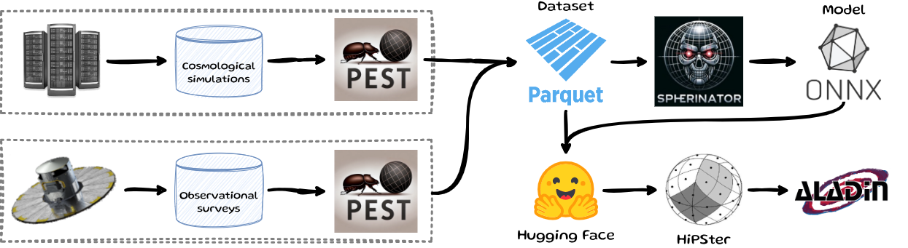
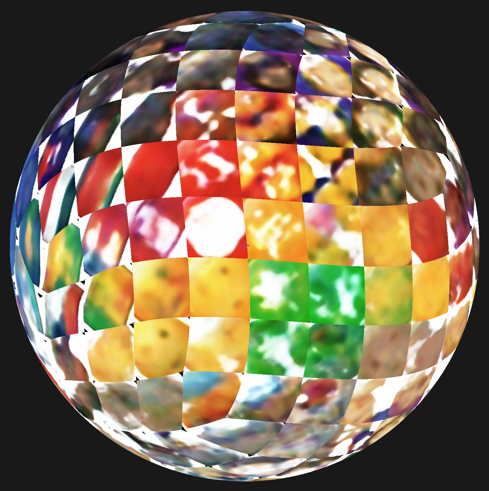
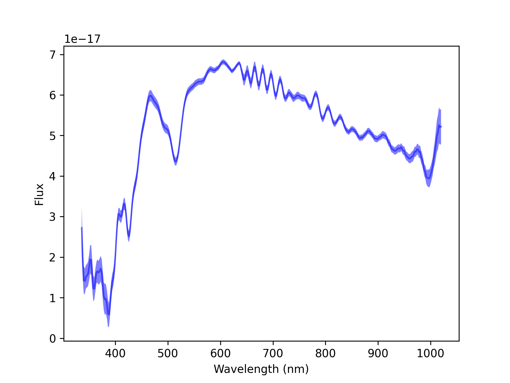

## Motivation {auto-animate="true"}

- The amount of astronomical data is [***growing exponentially***]{.green-text}
  - Exascale cosmological simulations produce [***petabytes of data***]{.green-text}
  - Surveys (e.g. Euclid, Rubin) generate [***terabytes of data daily***]{.green-text}

- Machine learning methods are needed to explore this amount of data and to extract knowledge

- [**Our goal:**]{.green-text} To develop modular open-source tools for self-supervised knowledge discovery and interactive visualization of large-scale cosmological data


<!-- ## Agenda {auto-animate="true"}

- The Data Pipeline
- How to Learn the Representation?
- The (Hyper-)Spherical Latent Space
- Interactive Visualization
- The Shared Universe Engine

{.absolute top=-120 right=-120 width="500" height="500"} -->


## {height="60px" style="vertical-align: middle;"} Data Acquisition {auto-animate="true"}

- [PEST](https://github.com/HITS-AIN/PEST) preprocesses universal cosmological simulation data into multi-channel images, data cubes, and point clouds

- ETL (Extract $\rightarrow$ Transform $\rightarrow$ Load) pipeline driven by YAML
<!-- - FAIR data management principles -->

- [Apache Parquet](https://parquet.apache.org/) stores efficiently multi-modal data in a columnar data storage

- Upload to [Hugging Face](https://huggingface.co/) or [Zenodo](https://zenodo.org/) for easy sharing and integration with ML frameworks


## {height="60px" style="vertical-align: middle;"} Representation Learning {auto-animate="true"}

- Representation learning using a [***aariational autoencoder***]{.green-text}

{fig-align="center" style="width: 700px; margin-bottom: -40px;"}

[@Polsterer2024; @Doser2026]{style="font-size: 50%;"}

- Dimensionality reduction to a [***(hyper-)spherical latent space***]{.green-text}
- Completely [***self-supervised***]{.green-text} - no labels required
- Export to [ONNX](https://onnx.ai/) for [***interoperability***]{.green-text} with other frameworks


## Why a (Hyper-)Spherical Latent Space? {auto-animate="true"}

:::: {.columns}
::: {.column width="50%"}
- [***Unbiased representation learning***]{.green-text}: The (hyper-)sphere has no preferred directions
<!-- , so it does not bias the model towards any particular features or patterns in the data. -->
- [***Better interpolation***]{.green-text}: The (hyper-)sphere allows for smooth interpolation between points in the latent space
<!-- , which can lead to better reconstruction and generation of new data. -->
:::

::: {.column width="50%"}
{fig-align="center"style="width: 80%; margin-bottom: -40px;"}

[@DeCao2020]{style="font-size: 50%;"}
:::
::::


<!-- ## How many dimensions? {auto-animate="true"}

::: {style="font-size: 70%;"}
**PCA analysis** of the bottleneck feature space: eigenvalue decay reveals the intrinsic dimensionality of the data.
:::

{width="700" fig-align="center"} -->


## How many dimensions? {auto-animate="true"}

::: {style="font-size: 70%;"}
Determine the optimal number of dimensions in the latent space by analyzing the reconstruction.
:::


```{python}
#| fig-align: center
import pandas as pd
import plotly.graph_objects as go

df = pd.read_json("data/illustris_vae_resnet18.json")

fig = go.Figure()

fig.add_trace(go.Scatter(
    x=df["sdim"], y=df["l1loss_val_min"],
    mode="lines+markers",
    name="Validation",
    line=dict(color="#0088c2", width=3),
    marker=dict(size=10),
))

fig.add_trace(go.Scatter(
    x=df["sdim"], y=df["l1loss_train_min"],
    mode="lines+markers",
    name="Training",
    line=dict(color="#cee6f5", width=3),
    marker=dict(size=10),
))

fig.update_layout(
    hovermode=False,
    xaxis_title="S<sup>n</sup>",
    yaxis_title="L1 loss",
    paper_bgcolor="rgba(0,0,0,0)",
    plot_bgcolor="rgba(0,0,0,0)",
    font=dict(color="#cee6f5", size=16),
    xaxis=dict(gridcolor="rgba(206,230,245,0.2)", linecolor="rgba(206,230,245,0.4)"),
    yaxis=dict(gridcolor="rgba(206,230,245,0.2)", linecolor="rgba(206,230,245,0.4)"),
    legend=dict(bgcolor="rgba(0,0,0,0)"),
    margin=dict(l=60, r=20, t=20, b=60),
)

fig.show(config={"displayModeBar": False})
```


## Reconstruction Quality {auto-animate="true"}

::: {style="font-size: 70%;"}
Original IllustrisTNG SKIRT SDSS images\
{width="1000" fig-align="center"}

ResNet-18 autoencoder, 512 features: Sufficient reconstruction\
{width="1000" fig-align="center"}

ResNet-18 VAE-S$^{128}$: Details are present, but blurry\
{width="1000" fig-align="center"}
:::


## Reconstruction Quality {auto-animate="true"}

::: {style="font-size: 70%;"}
Original IllustrisTNG SKIRT SDSS images\
{width="1000" fig-align="center"}

ResNet-18 VAE-S$^{128}$: Details are present, but blurry\
{width="1000" fig-align="center"}

ResNet-18 VAE-S${^2}$: Details are lost, but the overall structure is preserved\
{width="1000" fig-align="center"}
:::


## UMAP vs. Spherinator {auto-animate="true"}

:::: {.columns}
::: {.column width="55%"}
{fig-align="center"style="width: 80%;"}
:::

::: {.column width="45%"}
- [***UMAP***]{.green-text} is a popular dimensionality reduction technique, but it typically distorts the global data structure by using a 2D projection
- [***Spherinator***]{.green-text} preserves the global data structure by using a sphere, leading to more meaningful representations
:::
::::


## {height="60px" style="vertical-align: middle;"} HiPSter {auto-animate="true"}

:::: {.columns}
::: {.column width="55%"}
- Takes the [***spherical latent positions***]{.green-text} from Spherinator
- Generates a [***HiPS***]{.green-text} ([***Hi***]{.green-text}erarchical [***P***]{.green-text}rogressive [***S***]{.green-text}urvey) map
- Enables [***progressive zoom***]{.green-text} - more detail as you zoom in
- Works with any standard HiPS viewer (e.g. [Aladin-Lite](https://github.com/cds-astro/aladin-lite))
:::
::: {.column width="45%"}
::: {style="text-align: center;"}
{width="50%"}
{width="80%" style="margin-bottom: -20px;"}\
[@Fernique_2015]{style="font-size: 50%;"}
:::
:::
::::


## End-to-End ML Pipeline {auto-animate="true"}

{fig-align="center"}

- **PEST** processes the huge data amount [***on-site***]{.green-text} and uploads a standardised [Parquet](https://parquet.apache.org/) dataset
- **Spherinator** learns a [***compact spherical representation***]{.green-text} and exports it via [ONNX](https://onnx.ai/)


## VAE-S$^2$ with Emojis {auto-animate="true"}

:::: {.columns}
::: {.column width="50%"}
::: {style="text-align: center;"}
[**Projected**]{.green-text}
:::

{fig-align="center" style="width: 70%;"}
:::
::: {.column width="50%"}
::: {style="text-align: center;"}
[**Generated**]{.green-text}
:::

{fig-align="center" style="width: 70%;"}
:::
::::

::: {style="font-size: 70%; text-align: center; margin-top: -40px;"}
[valhalla/emoji-dataset](https://huggingface.co/datasets/valhalla/emoji-dataset) (2,749 emojis)
:::


## VAE-S$^2$ with Celebrities {auto-animate="true"}

:::: {.columns}
::: {.column width="55%"}
::: {style="text-align: center; border: 1px solid #cee6f5; border-radius: 8px; padding: 0.5em 1em; margin-bottom: 0.75em; font-style: italic;"}
"Fill the sky with stars"
:::

- [tonyassi/celebrity-1000](https://huggingface.co/datasets/tonyassi/celebrity-1000): 18,184 images of 1000 celebrities

:::
::: {.column width="45%"}
<!-- ```{=html}
<iframe width="600" height="600" src="https://space.h-its.org/celebrities/"></iframe>
``` -->
<video src="../videos/celebrities.mp4" controls></video>
:::
::::


<!-- ## Gaia Spectral Data {auto-animate="true"}

::: {layout='[1,1]'}
::: n1
::: {style="font-size: 80%;"}
- [Gaia DR3 XP](http://cdn.gea.esac.esa.int/Gaia/gdr3/): Largest most uniform all-sky spectrophotometric survey (over 220 million sources)
- Low-resolution spectra reveal temperature and chemical composition

{fig-align="center"}
:::
:::

::: n2
```{=html}
<iframe width="600" height="600" src="https://space.h-its.org/Gaia/"></iframe>
```
:::
::: -->


## Gaia Explorer {auto-animate="true"}

::: {style="font-size: 80%;"}
<!-- [Gaia DR3 XP](http://cdn.gea.esac.esa.int/Gaia/gdr3/): -->
Largest most uniform all-sky spectrophotometric survey [***(over 220 million sources)***]{.green-text}
:::

<!-- {fig-align="center"} -->
```{=html}
<video autoplay loop muted playsinline
 width="90%"
 src="../videos/gaia_explorer.mp4">
</video>
```

::: {style="font-size: 50%;"}
@Doser2026
:::


<!-- ## Gaia Explorer
<video src="../videos/presentation_ready.mp4" controls width="100%" height="85%"></video> -->


<!-- ## {background-video="../videos/presentation_ready.mp4"} -->


<!-- ## Deployment Platform

::: {style="font-size: 70%;"}
[Flyte](https://flyte.org/) orchestrates the full **PEST → Spherinator → HiPSter** workflow — reproducible, scalable pipelines on HPC and cloud infrastructure.
:::

{fig-align="center" width="900"} -->


## Outlook: Shared Universe Engine {auto-animate="true"}

::: {layout='[1,1]'}
::: n1
{fig-align="center" style="width: 40%; margin-bottom: -30px;"}

::: {style="font-size: 80%;"}
- [DynaVerse](https://dynaverse.astro.uni-koeln.de/) is a [***German Cluster of Excellence***]{.green-text} that combines [***astrophysics, mathematics, and computer science***]{.green-text} to study cosmic processes of different timescales
- The SUE (Shared Universe Engine) is a [***unified platform***]{.green-text} connecting data, models, and simulations across scales and disciplines
:::
:::
::: n2
{fig-align="center"}
:::
::::


<!-- ## Summary {auto-animate="true"}

- **PEST**: ETL pipeline for cosmological simulations and observations
- **Spherinator**: Self-supervised VAE with (hyper-)spherical latent space for unbiased representation learning
- **HiPSter**: Scalable interactive visualization via progressive HiPS maps on the sphere
- **DynaVerse SUE**: Unified platform connecting data, models, and simulations across scales and disciplines -->


## Thank you for your attention! {auto-animate="true"}

:::: {.columns}
::: {.column width="50%"}
{fig-align="center" style="width: 30%"}
:::
::: {.column width="50%" style="text-align: center;"}
{fig-align="center" style="width: 60%"}

[space.h-its.org](https://space.h-its.org)
:::
::::


## Acknowledgement & Disclaimer {auto-animate="true"}

{fig-align="center"}

::: {style="font-size: 60%; margin-top: -40px;"}
Funded by the European Union. This work has received funding from the European High Performance Computing Joint Undertaking (JU) and Belgium, Czech Republic, France, Germany, Greece, Italy, Norway, and Spain under grant agreement No 101093441.

Views and opinions expressed are however those of the author(s) only and do not necessarily reflect those of the European Union or the European High Performance Computing Joint Undertaking (JU) and Belgium, Czech Republic, France, Germany, Greece, Italy, Norway, and Spain. Neither the European Union nor the granting authority can be held responsible for them.
:::

{fig-align="center" width="400"}


## Associated Materials {auto-animate="true"}

<!-- {.absolute top=50 right=0 width=200} -->

- Repositories:
  - [PEST](https://github.com/HITS-AIN/PEST): Data acquisition and preprocessing
  - [Spherinator](https://github.com/HITS-AIN/Spherinator): Representation learning
  - [HiPSter](https://github.com/HITS-AIN/HiPSter): Generation of HiPS maps and catalogs
- User documentation: [ReadTheDocs](https://spherinator.readthedocs.io/en/latest/index.html)
- Tutorials: [SPACE HPC Visualization Workshop](https://github.com/BerndDoser/SPACE_HPC_Visualization_Workshop)


## References {auto-animate="true"}
