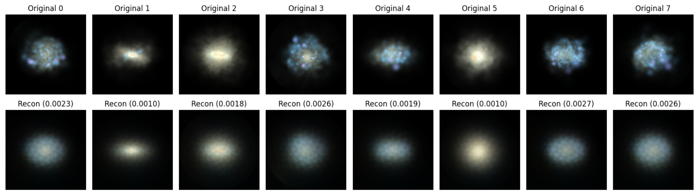

## Agenda

- The Data Pipeline
- How to learn the representation?
- The (Hyper-)Spherical Latent Space
- The Shared Universe Engine (DynaVerse SUE)

{.absolute top=-120 right=-100 width="700" height="700"}


<!-- ## Associated Materials

{.absolute top=50 right=0 width=200}

- The presentation and demo notebooks are publicly available at\
  [github.com/BerndDoser/SPACE_HPC_Visualization_Workshop](https://github.com/BerndDoser/SPACE_HPC_Visualization_Workshop)
- Related project repositories:
  - [PEST](https://github.com/HITS-AIN/PEST): Data acquisition and preprocessing
  - [Spherinator](https://github.com/HITS-AIN/Spherinator): Representation Learning using PyTorch Lightning
  - [HiPSter](https://github.com/HITS-AIN/HiPSter): Generation of HiPS maps and catalogs
- User documentation is available at
  [ReadTheDocs](https://spherinator.readthedocs.io/en/latest/index.html) -->


## The Data Pipeline {auto-animate="true"}

{.absolute left=0 width=1800}


## The Data Pipeline {auto-animate="true"}

- [PEST](https://github.com/HITS-AIN/PEST) preprocess universal cosmological simulation data into multi-channel images, data cubes, and point clouds
- [Apache Parquet](https://parquet.apache.org/) stores multi-modal data in an efficient columnar data storage

{width=400}


## Representation Learning with Spherinator

- Representation learning using a **Variational Autoencoder**
- Dimensionality reduction to a **(Hyper-)Spherical Latent Space**

{width="1100" fig-align="center"}

::: aside
Source: @Polsterer2024, @Doser2025
:::


## How many dimensions?

{width="800" fig-align="center"}


## How many dimensions?

::: {style="font-size: 70%;"}
Determine the optimal number of dimensions in the latent space by analyzing the reconstruction.
:::


```{python}
#| fig-align: center
import pandas as pd
import plotly.graph_objects as go

df = pd.read_json("data/illustris_vae_resnet18.json")

fig = go.Figure()

fig.add_trace(go.Scatter(
    x=df["sdim"], y=df["l1loss_val_min"],
    mode="lines+markers",
    name="Validation",
    line=dict(color="#0088c2", width=3),
    marker=dict(size=10),
))

fig.add_trace(go.Scatter(
    x=df["sdim"], y=df["l1loss_train_min"],
    mode="lines+markers",
    name="Training",
    line=dict(color="#cee6f5", width=3),
    marker=dict(size=10),
))

fig.update_layout(
    hovermode=False,
    xaxis_title="S<sup>n</sup>",
    yaxis_title="L1 loss",
    paper_bgcolor="rgba(0,0,0,0)",
    plot_bgcolor="rgba(0,0,0,0)",
    font=dict(color="#cee6f5", size=16),
    xaxis=dict(gridcolor="rgba(206,230,245,0.2)", linecolor="rgba(206,230,245,0.4)"),
    yaxis=dict(gridcolor="rgba(206,230,245,0.2)", linecolor="rgba(206,230,245,0.4)"),
    legend=dict(bgcolor="rgba(0,0,0,0)"),
    margin=dict(l=60, r=20, t=20, b=60),
)

fig.show(config={"displayModeBar": False})
```


## Reconstruction Quality

{width="800" fig-align="center"}


## The Power Spherical Distribution {auto-animate="true"}

:::: {.columns}

::: {.column width="55%"}
- The **Power Spherical distribution** is a generalization of the von Mises-Fisher distribution, allowing for more flexible modeling of data on hyperspheres.
:::

::: {.column width="45%"}
{width="600" fig-align="center"}
[[@DeCao2020]]{style="font-size: 50%;"}
:::

::::


## HiPSter: The Inference

{width="800" fig-align="center"}

- The **HEALPix framework** is used to generate a **Hierarchical Progressive Survey (HiPS)** for the corresponding spherical latent space positions.
- [Aladin-Lite](https://github.com/cds-astro/aladin-lite) is designed to visualize the HiPS representation.

[[@Fernique_2015]]{style="font-size: 50%;"}


## Gaia Spectra Explorer {auto-animate="true"}

<!-- [Gaia DR3 XP](http://cdn.gea.esac.esa.int/Gaia/gdr3/) -->

::: {style="font-size: 80%;"}
- Largest most uniform all-sky spectrophotometric survey (over 220 million sources)
- Low-resolution spectra reveal temperature and chemical composition
:::

{fig-align="center"}

::: {style="font-size: 50%;"}
@Doser2026
:::


## Gaia Spectra Explorer {auto-animate="true"}

```{=html}
<iframe width="600" height="600" src="https://space.h-its.org/Gaia/" title="Webpage example"></iframe>
```


## AI Deployment Platform

{fig-align="center"}


## Summary and Outlook

- The **(Hyper-)Spherical latent space** provides a powerful tool for exploring and visualizing cosmological data.

- The **Shared Universe Engine (Dynaverse SUE)** will facilitate new insights into the structure and evolution of the universe.

- First results [space.h-its.org](https://space.h-its.org)


## Acknowledgement & Disclaimer

{width=1300}


## References
