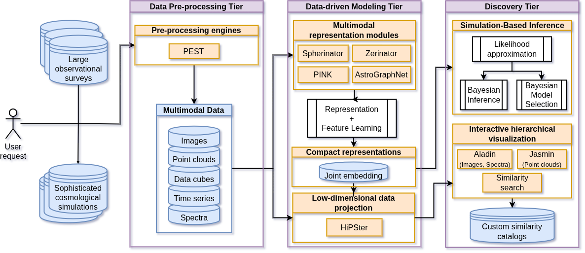
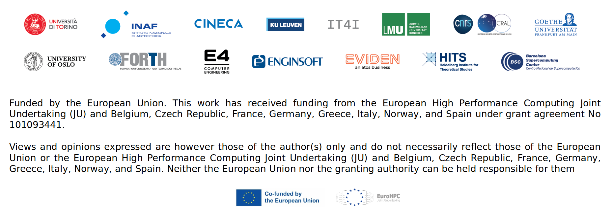

<!-- ## Structure

- PEST
  - ETL pipeline
  - [HuggingFace](https://huggingface.co/HITS-AIN)

- Spherinator
  - Feature space
    - How many dimensions?
    - UMAP
  - Variational Autoencoder (VAE)
  - Hyper-spherical latent space
    - Power Spherical distribution
    

- HiPSter
  - **Hi**erarchical **P**rogressive **S**urvey (HiPS) - The more you zoom in, the more details you see.

- The Multimodal Universe
- Shared Universe Engine (DynaVerse SUE) -->


## Agenda

- The Data Pipeline
- How to learn the representation?
- The (Hyper-)Spherical Latent Space
- The Shared Universe Engine (DynaVerse SUE)

{.absolute top=-120 right=-100 width="700" height="700"}


<!-- ## Associated Materials

{.absolute top=50 right=0 width=200}

- The presentation and demo notebooks are publicly available at\
  [github.com/BerndDoser/SPACE_HPC_Visualization_Workshop](https://github.com/BerndDoser/SPACE_HPC_Visualization_Workshop)
- Related project repositories:
  - [PEST](https://github.com/HITS-AIN/PEST): Data acquisition and preprocessing
  - [Spherinator](https://github.com/HITS-AIN/Spherinator): Representation Learning using PyTorch Lightning
  - [HiPSter](https://github.com/HITS-AIN/HiPSter): Generation of HiPS maps and catalogs
- User documentation is available at
  [ReadTheDocs](https://spherinator.readthedocs.io/en/latest/index.html) -->


## The Data Pipeline

{.absolute left=0 width=1800}


## The Data Pipeline

- [PEST](https://github.com/HITS-AIN/PEST) preprocess universal cosmological simulation data into multi-channel images, data cubes, and point clouds
- [Apache Parquet](https://parquet.apache.org/) stores multi-modal data in an efficient columnar data storage


## Representation Learning with Spherinator

- Representation learning using a **Variational Autoencoder**
- Dimensionality reduction to a **(Hyper-)Spherical Latent Space**

{width="1100" fig-align="center"}

::: aside
Source: @Polsterer2024, @Doser2025
:::


## How many dimensions?

{width="800" fig-align="center"}

## Spherinator: The Power Spherical Distribution {auto-animate="true"}

:::: {.columns}

::: {.column width="55%"}
- The **Power Spherical distribution** is a generalization of the von Mises-Fisher distribution, allowing for more flexible modeling of data on hyperspheres.
:::

::: {.column width="45%"}
{width="600" fig-align="center"}
Source: @DeCao2020
:::

::::


## HiPSter: The Inference

{width="800" fig-align="center"}

- The **HEALPix framework** is used to generate a **Hierarchical Progressive Survey (HiPS)** for the corresponding spherical latent space positions.
- [Aladin-Lite](https://github.com/cds-astro/aladin-lite) is designed to visualize the HiPS representation.

::: aside
Source: @Fernique_2015
:::


## Gaia DR3 XP Spectra

::: {layout='[1,1]'}
::: n1
::: {style="font-size: 80%;"}
[Gaia DR3 XP](http://cdn.gea.esac.esa.int/Gaia/gdr3/) 
contains over **200 million** blue (BP) and red (RP) spectra as continuous spectra with 55 parameters per spectrum.
{width="600"}


:::
:::
::: n2
```{=html}
<iframe width="600" height="600" src="https://space.h-its.org/Gaia/" title="Webpage example"></iframe>
```
:::
:::


## AI Deployment Platform

{fig-align="center"}


## Summary and Outlook


- The **(Hyper-)Spherical latent space** provides a powerful tool for exploring and visualizing cosmological data.

- The **Shared Universe Engine (DynaVerse SUE)** will facilitate new insights into the structure and evolution of the universe.

- First results @ [space.h-its.org](https://space.h-its.org)


## Acknowledgement & Disclaimer

{width=1300}


## References
